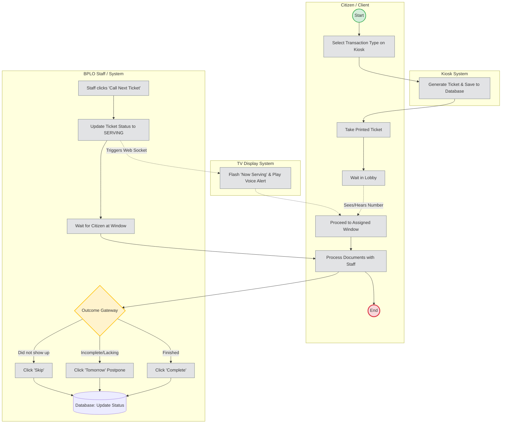

# Business Process Model and Notation (BPMN)

This document contains a BPMN 2.0 style diagram representing the complete business workflow of the BPLO Queuing System. It utilizes swimlanes to distinguish the responsibilities of the Citizen, the Kiosk, the TV Display, and the BPLO Staff.

This diagram is ideal for the **Business Process** section of your thesis, as it illustrates the step-by-step physical and digital interactions from the moment a client walks in to the moment they leave.

## BPMN Workflow Diagram

## Detailed Process Explanation

1. **Start Event:** The process begins when a citizen enters the BPLO.
2. **Kiosk System (Self-Service):** 
   - The citizen interacts with the iPad/Tablet kiosk and selects their required service (New, Renewal, Retirement).
   - The system generates a categorized ticket number, saves it to the database, and provides the ticket to the citizen.
3. **Waiting State:** The citizen waits in the lobby.
4. **Staff Action (Call):** A BPLO staff member clicks "Call Next" on their computer dashboard. The system updates the ticket status from `WAITING` to `SERVING`.
5. **Broadcast (TV System):** The system instantly sends a real-time WebSocket event to the TV Display, which flashes the ticket number and plays a Text-To-Speech (TTS) audio alert (e.g., "Ticket NW-001, please proceed to Window 1").
6. **Service Execution:** The citizen hears the alert, approaches the window, and processes their documents with the staff.
7. **Gateway Resolution (Completion):** After the physical interaction, the staff makes a decision at the gateway:
   - **Complete:** The transaction was successful.
   - **Postpone (Tomorrow):** The citizen lacked requirements and must return the next day.
   - **Skip:** The citizen never approached the window.
8. **End Event:** The database is permanently updated with the final status and completion timestamp, and the citizen leaves the office.
