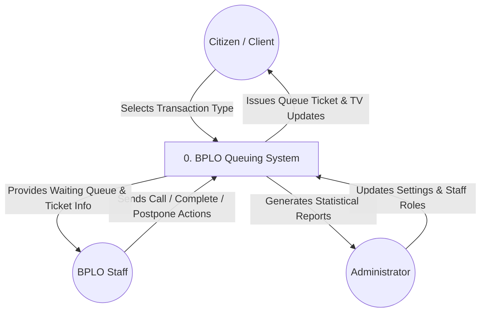
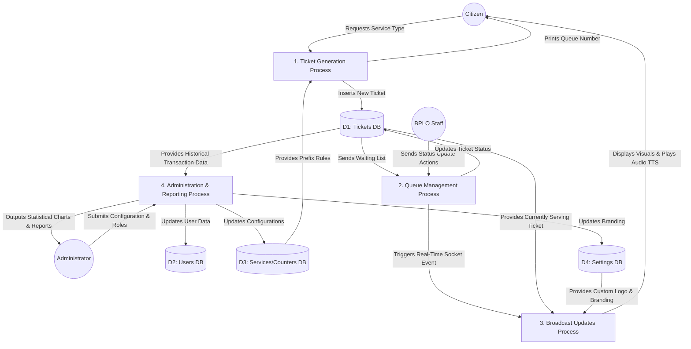

# Data Flow Diagrams (DFD)

This document contains the Data Flow Diagrams representing how information moves through the BPLO Queuing System. These diagrams are essential for Chapter 3 of your thesis (System Architecture & Design).

## 1. Context Diagram (Level 0 DFD)

The Context Diagram provides a high-level overview of the entire system, showing how external entities (Clients, Staff, and Admins) interact with the BPLO Queuing System as a whole.

---

## 2. Level 1 Data Flow Diagram

The Level 1 DFD breaks down the main system into specific processes (Ticket Generation, Queue Management, Broadcasting, and Administration) and shows how data is stored and retrieved from the system's database tables.

### Explanation of Level 1 Processes:
1. **Ticket Generation Process (Kiosk):** Takes the citizen's request, reads the service rules from D3, saves the ticket into D1, and gives the citizen their number.
2. **Queue Management Process (Staff Dashboard):** Reads the waiting list from D1, accepts actions from the staff (Call, Complete, Postpone), updates the database, and alerts the broadcast system.
3. **Broadcast Updates Process (TV Display):** Listens for events from Process 2, fetches the current ticket from D1 and branding from D4, and announces the ticket to the citizen via visuals and voice.
4. **Administration & Reporting Process (Admin Dashboard):** Allows the admin to manage D2, D3, and D4. Most importantly, it pulls historical completed tickets from D1 to generate printable performance statistics.
