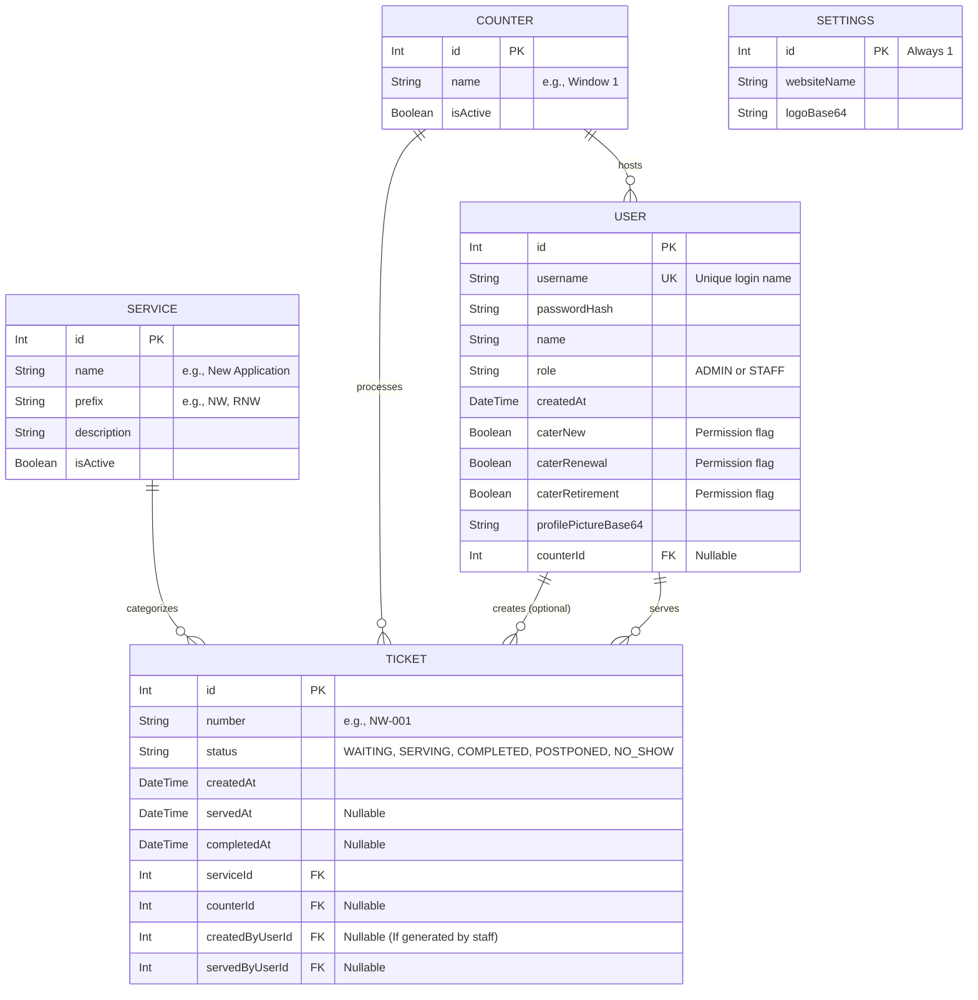

# Entity-Relationship (ER) Model

This document outlines the database structure and relationships for the BPLO Queuing System. It can be directly included in your Chapter 3 (Methodology / System Design) of your thesis.

## ER Diagram

Below is the Entity-Relationship diagram illustrating how the different data tables in our SQLite database connect to each other.

## Entity Descriptions

### 1. USER
Stores all credentials and permissions for the government personnel. 
* **Key Fields:** `role` determines if they have access to the Admin Dashboard. `caterNew`, `caterRenewal`, and `caterRetirement` determine which tickets pop up on their specific Staff Dashboard. `counterId` links them to the physical window they are sitting at.

### 2. SERVICE
Defines the types of transactions the BPLO handles.
* **Key Fields:** `prefix` is used to automatically generate the ticket numbers (e.g., if prefix is "NW", the ticket becomes "NW-001").

### 3. COUNTER
Represents the physical service windows in the office.
* **Relationships:** Staff members (Users) are assigned to Counters, and Tickets are routed to these Counters when called.

### 4. TICKET
The core entity representing a citizen's transaction in the queue.
* **Key Fields:** `status` tracks the lifecycle of the queue (`WAITING` -> `SERVING` -> `COMPLETED`, or `POSTPONED` for tomorrow). The timestamps (`createdAt`, `servedAt`, `completedAt`) are critical because they are used by the Admin Dashboard to calculate exact waiting times, service durations, and employee efficiency statistics.
* **Relationships:** Every ticket is linked to exactly one `Service`. It is also linked to the `Counter` it was called to, and the `User` (Staff) who served it.

### 5. SETTINGS
A single-row configuration table.
* **Key Fields:** Stores the global `websiteName` and the `logoBase64` image so that the Admin can dynamically change the branding of the Kiosk and TV Display without editing the code.
