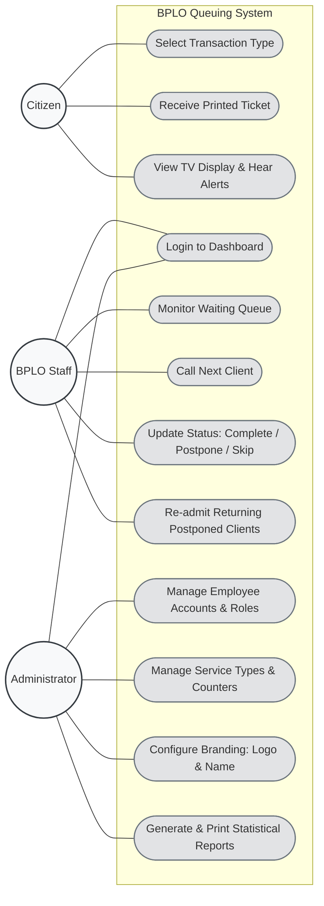

# Use Case Diagram

This document contains the Use Case Diagram for the BPLO Queuing System, illustrating the primary actors and the specific actions (use cases) they can perform within the system boundaries. This is another crucial diagram for Chapter 3 of your thesis.

## Diagram

## Actor Descriptions

1. **Citizen / Client:** The primary end-user of the system's front-facing interfaces. Their interaction is limited entirely to the Kiosk for generating tickets, and the TV display for receiving queue updates. They do not have access to any dashboards.
2. **BPLO Staff:** The personnel stationed at the service windows. They have restricted access to the dashboard where they can only view and manipulate tickets assigned to the specific services they are authorized to handle (e.g., New Applications vs. Renewals).
3. **Administrator:** The system manager (often the BPLO Head or IT personnel). They possess full privileges to oversee the entire system, manage the staff accounts, update the visual branding of the office, and pull analytics and reports to track office performance.
